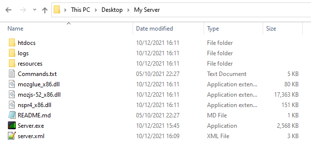
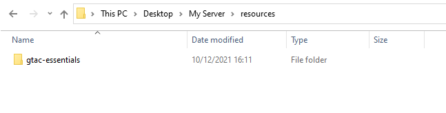
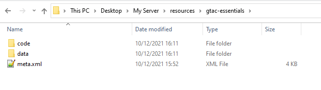

# Essentials Resource
This resource (Essentials) is compatible with the GTA:Connected multiplayer.

Game support for Essentials: III, VC, or SA. (This resource does not currently support IV)

Essentials contains over 200 commands, comes with a mapper, and is free.

Check Commands.txt for available commands.

<hr>

To get started:

(Registering your account.)

1) Start the server.
2) Register an account by typing /register password


(Setting your account level.)

3) Stop the server.
4) Set your Players.xml file to the 3 lines of XML code below:

   The Players.xml file path is located at: resources/gtac-essentials/data/scripts/admin/Players.xml

```xml
<Root>
	<Player name="Mex" Level="10" />
</Root>
```

5) Change the username to the name that you registered with the /register command, then save the XML file.
6) Start the server.


(Generic.)

7) To change another player's level, use this command in-game: /setlevel name level

   e.g. /setlevel PlayerName 10
8) To view all commands in-game, type /commands


Directory Contents Example




